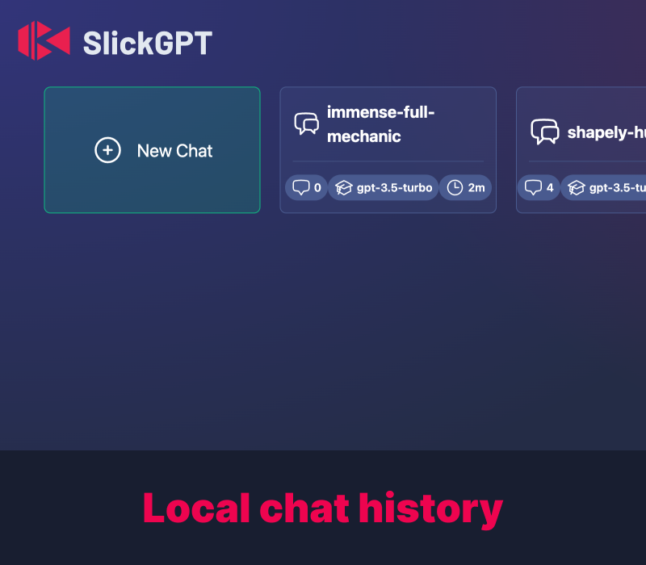
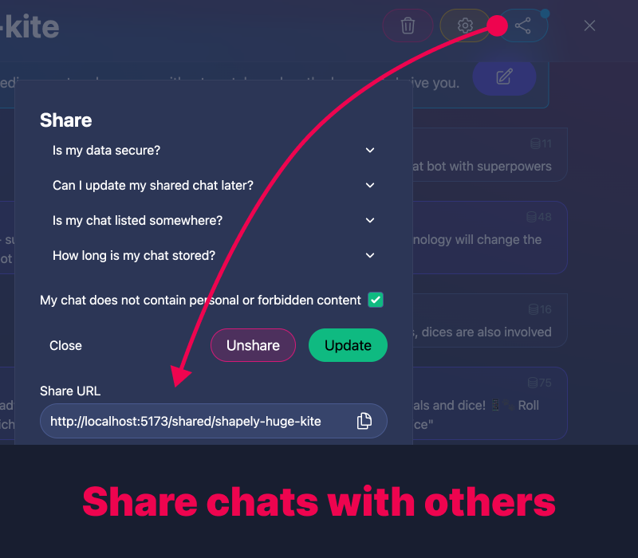
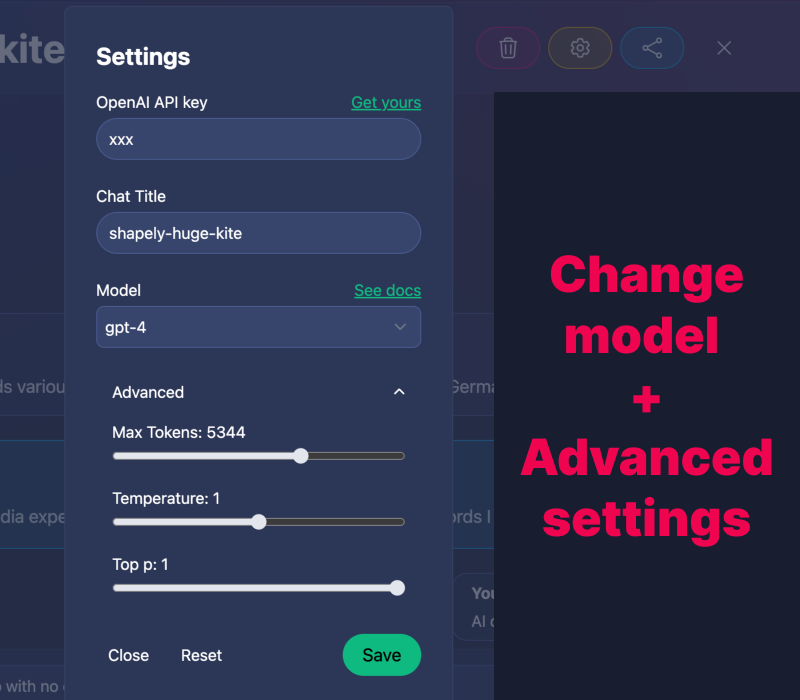
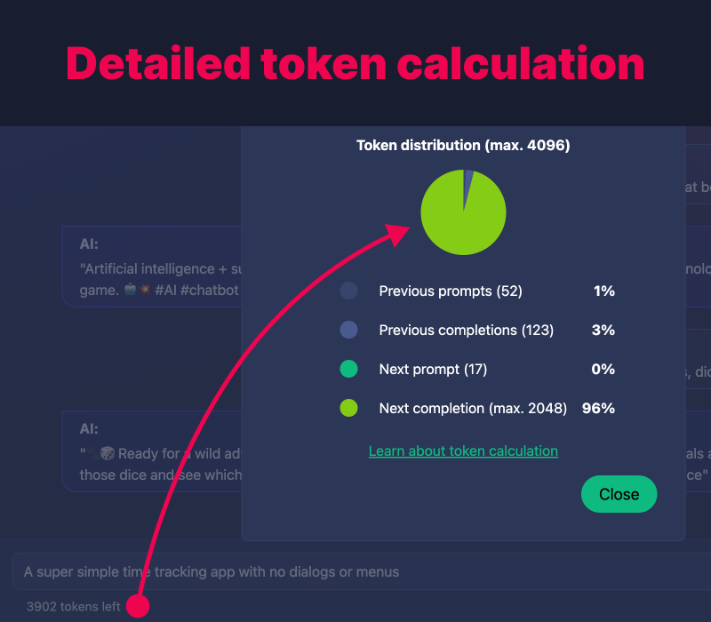
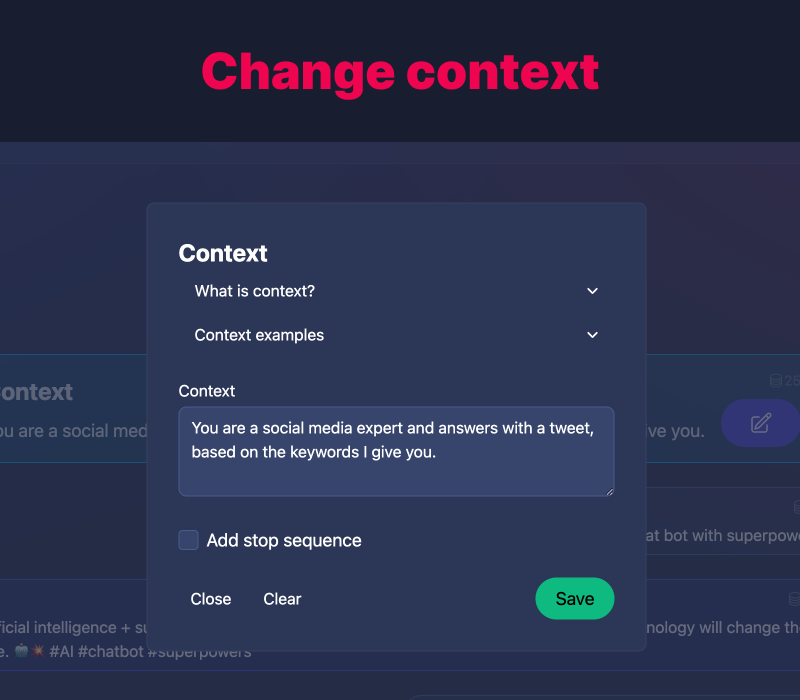
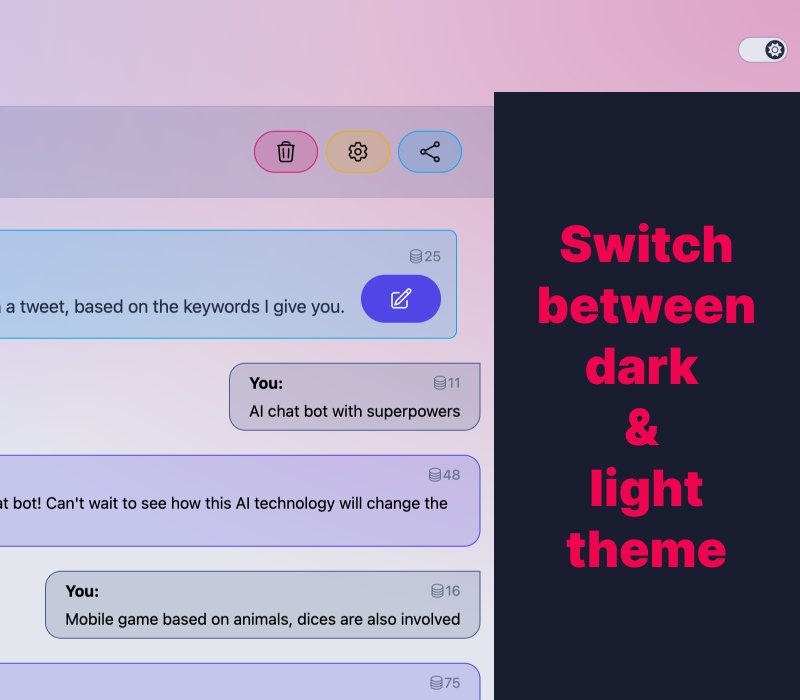

<a name="readme-top"></a>

[![Contributors][contributors-shield]][contributors-url]
[![Forks][forks-shield]][forks-url]
[![Stargazers][stars-shield]][stars-url]
[![Issues][issues-shield]][issues-url]
[![MIT License][license-shield]][license-url]
[![LinkedIn][linkedin-shield]][linkedin-url]

## Built With

[![Svelte][svelte-shield]][svelte-url] [![SvelteKit][sveltekit-shield]][sveltekit-url] [![Skeleton][skeleton-shield]][skeleton-url] [![OpenAI][openai-shield]][openai-url]

<!-- PROJECT LOGO -->
<br />
<div align="center">
  <a href="https://slickgpt.vercel.app/">
    
  </a>

  <h3 align="center">SlickGPT</h3>

  <p align="center">
    An awesome ChatGPT Client - with Superpowers!
    <br />
    <a href="https://slickgpt.vercel.app/"><strong>Try for yourself »</strong></a>
    <br />
    <br />
    <a href="https://platform.openai.com/account/api-keys">Get your API key</a>
    ·
    <a href="https://github.com/ShipBit/slickgpt/issues">Report Bug</a>
    ·
    <a href="https://github.com/ShipBit/slickgpt/issues">Request Feature</a>
  </p>
</div>

<!-- TABLE OF CONTENTS -->
<details>
  <summary>Table of Contents</summary>
  <ol>
    <li><a href="#about-the-project">About The Project</a></li>
    <li><a href="#features">Features</a></li>
    <li><a href="#comparison-with-chatgpt">Comparison with ChatGPT</a></li>
    <li><a href="#roadmap">Roadmap</a></li>
    <li><a href="#development">Development</a></li>
    <li><a href="#license">License</a></li>
    <li><a href="#contact">Contact</a></li>
  </ol>
</details>

## About the project

![SlickGPT][slickgpt-screenshot]

SlickGPT is a light-weight "use-your-own-API-key" web client for the OpenAI API written in Svelte. Users bring their own OpenAI API keys. SlickGPT offers them a very fancy user interface with a rich feature set like managing a local chat history (in the localStorage), a userless "Share" function for chats, a prominent context editor, and token cost calculation and distribution. You can run the client locally, host it yourself or use our public instance.

## Feature Overview

- **Fancy User Interface** <br> Interact with an elegant and cleanUI that makes chatting fun and explains a lot of the heavy stuff to users.
- **Mobile first and fully responsive** <br> SlickGPT is always at your hand. Literally, on your phone.
- **Local History** <br> Your chat history is stored in localStorage and never leaves your machine (until you actively decide to share chats).
- **Share Chats** <br> Generate shareable links for your chats with 3 clicks to collaborate and brainstorm ideas with your team or friends. Without any authentication.
- **Set Context** <br> Provide your own context to guide the AI model while giving responses, ensuring relevant and focused outcomes.
- **Cost Calculation** <br> Keep track of and control your API usage costs with an in-built token cost calculator for your chats.
- **Full Configuration Power** <br> Customize OpenAI model settings to tailor the experience to your liking.
- **No Registration or Login required** <br> Create and even share chats without the need for a login or registration - Simple, fast, and efficient.
- **Use your own API Key** <br> Keep your API calls private and secure by using your own OpenAI API key.
- **Host Yourself / Run Everywhere** <br> Run the instance locally on your machine or host it on your preferred cloud provider.

<p align="right">[ <a href="#readme-top">back to top</a> ]</p>

## In more detail

### Local chat history

Your chat history is stored in the localStorage of your browser and never leaves your machine (unless you actively decide to share a chat.

<a href="static/docu/history.png">
  
</a>

### Share Chats

Share chats with 3 clicks to collaborate and brainstorm ideas with your team or friends. No authentication or registration necessary. You can also unshare or update shared chats later. Recipients can import shared chats with a single click and continue your conversation in their own local chat instance.

<a href="static/docu/share.png">
  
</a>

### Change advanced settings

SlickGPT allows you to customize all parameters the OpenAI API offers to your liking. You can change the model, temperature, top_p, and frequency_penalty parameters to get the best results. You can also set the the chat context (or "system" message) to guide the AI model and shape its behaviour and answers and even use "stop sequences" to limit the answers you get.

<a href="static/docu/settings.png">
  
</a>

### Detailed token calculation

SlickGPT provides an in-built token cost calculator for your chats. You can see the cost of your chat in real-time as you type and receive answers. This allows you to keep track of and control your API usage. SlickGPT also has a posh pie chart that visualizes the cost distribution within a chat.

<a href="static/docu/tokens.png">
  
</a>

### Change context

Do you know what "context" is when talking to ChatGPT? Most users don't and that's why SlickGPT displays and explains the concept very clearly with explanations and examples when you start a new chat. This way, one of the most powerful features just becomes "part of the chat".

<a href="static/docu/context.png">
  
</a>

### Switch between light and dark mode

SlickGPT offers a light and dark theme. You can switch between the two modes by clicking the toggle button in the top right corner and once you do, it will remember your choice.

<a href="static/docu/light.png">
  
</a>

<p align="right">[ <a href="#readme-top">back to top</a> ]</p>

## Comparison with ChatGPT

While ChatGPT offers a great conversational AI experience, it lacks some features many users desire.

| Feature                     | SlickGPT | ChatGPT |
| --------------------------- | -------- | ------- |
| Use different models        | ✅       | ✅      |
| Chat history                | ✅       | ✅      |
| Highlight / Format code     | ✅       | ✅      |
| Use Your Own API Key        | ✅       | ✅      |
| Host Yourself / Run Locally | ✅       | ❌      |
| Share Chats                 | ✅       | ❌      |
| Set Context                 | ✅       | ❌      |
| Change model configuration  | ✅       | ❌      |
| No Login Required           | ✅       | ❌      |
| Token Cost Calculation      | ✅       | ❌      |
| Mobile-first design         | ✅       | ❌      |
| Edit and branch messages    | ❌       | ✅      |
| Stop generation             | ❌       | ✅      |

As you can see, SlickGPT includes several additional features that cater to a broad range of user needs, such as hosting the service yourself, using a local chat history, sharing chats, and customizing the chat configurations. Moreover, SlickGPT does not require a login, allowing for faster and more streamlined access. These added functionalities make SlickGPT a more versatile and convenient solution for users seeking an advanced ChatGPT experience.

<p align="right">[ <a href="#readme-top">back to top</a> ]</p>

<!-- ROADMAP -->

## Roadmap

- [x] Add light/dark mode switch
- [ ] Add theme switcher
- [ ] Editable messages and branching chat history
- [ ] Stop completion generation
- [ ] More documentation
- [ ] i18n
  - [ ] English
  - [ ] German

See the [open issues](https://github.com/ShipBit/slickgpt/issues) for a full list of proposed features and known issues.

<p align="right">[ <a href="#readme-top">back to top</a> ]</p>

## Development

SlickGPT uses [Svelte](https://svelte.dev/), [SvelteKit](https://kit.svelte.dev/) and [Skeleton UI](https://www.skeleton.dev/) as frontend foundation.

The secret sauce of SlickGPT is that almost everything is stored in the `localStorage` of the browser. One case where it leaves this boundary is, of course, when a user communicates with the [OpenAI API](https://platform.openai.com/). While questions are simple POST requests, responses are sent back to the client using the native [EventSource API](https://developer.mozilla.org/en-US/docs/Web/API/EventSource) and rendered as a "live stream" just like the ChatGPT client does.

The other case is when users share their chats with others using the "userless share" feature. Then SlickGPT dumps the appropriate `localStorage` object in a simple [Firebase Realtime Database](https://firebase.google.com/docs/database) and tags it with a random `updateToken`. A serverless (Edge) function sends this token back to the client where it is stored in the `localStorage` next to the original chat. The token can be used later to update or unshare chats.

SlickGPT uses Svelte endpoints as "proxy" between the client and the external APIs. This way, the client does not need to know any Firebase secrets at all and you have a great starting point to implement more complex "backend" logic if needed.

### Set environment Variables

Copy the content of `.env.example` to a new file called `.env` and populate the variables with your Firebase data. You can get this `firebaseConfig` from your project settings in the Firebase console.

While developing, Vite will be your "server" and run the endpoints functions on your local machine. It has access to your environment variables utilizing SvelteKits `$env/static/private` import.

For a production environment, the endpoints are preconfigured to run as edge functions on Vercel. For this to work, you simply have to provide Vercel with the required environment variables once you go live with your instance. You can paste the content of your `.env` file when you import your project to Vercel or afterwards in the project settings or using the Vercel CLI.

### Start the client

Once cloned, run the usual SvelteKit commands in your root directory:

```bash
npm i # or yarn, pnpm etc.
npm run dev -- --open
```

That's it! You should now be able to develop with all the hot reloading goodness you know and love from Svelte / Vite.

### Can I run this without Firebase?

Certainly. The quickest and easiest way would be to disable the "Share Chat" feature in SlickGPT in case you don't need it. We have an [open issue](https://github.com/ShipBit/slickgpt/issues/6) for that with good starting points.

The other (and better) way would be to use any other database where you can dump SlickGPTs serialized [Chat](https://github.com/ShipBit/slickgpt/blob/d7af3abb6eb9be8e6bb68c0f36334bb0448505ae/src/misc/shared.ts) objects. This should be an easy task because the client never directly talks to Firebase as described above. SlickGPT doesn't utilize any Firebase-specific features. As long as your database can somehow save and load a chat based using a slug as key, you should be fine. The only file you'd have to edit is the [share endpoint](https://github.com/ShipBit/slickgpt/blob/d7af3abb6eb9be8e6bb68c0f36334bb0448505ae/src/routes/api/share/+server.ts).

### Can I host this on other providers than Vercel?

There's an [open issue](https://github.com/ShipBit/slickgpt/issues/7) for that with some additionale infos regarding Netlify. We haven't tested other providers yet but it should be fine as long as your provider can run SvelteKit apps and serverless functions. We already saw a fork utilizing [Railway](https://railway.app/).

You could also let the client access the Firebase and OpenAI API directly to get rid of the serverless function requirement entirely.

### How do I use another Skeleton Theme?

Simply follow the instructions in the official [Skeleton UI documentation](https://www.skeleton.dev/docs/get-started#themes). The code you have to change is in SlickGPTs [+layout.svelte](https://github.com/ShipBit/slickgpt/blob/d7af3abb6eb9be8e6bb68c0f36334bb0448505ae/src/routes/+layout.svelte) file.

### Contribution Guidelines

Contributions are always welcome! Feel free to open a pull request, report bugs, or submit feature requests. Please follow the Code of Conduct and Contribution Guidelines when participating in this project.

### Main Contributors

<p>
  
  <br>
  <span>Simon Hopstätter</span>
</p>
<p>
  
  <br>
  <span>Timo Korinth</span>
</p>

<p align="right">[ <a href="#readme-top">back to top</a> ]</p>

## License

This project is licensed under the MIT License.

## Contact

SlickGPT was initially created by [Simon Hopstätter](https://www.shipbit.de/team) and [Timo Korinth](https://www.shipbit.de/team) at [Shipbit](https://www.shipbit.de).

If you have any questions, feel free to contact us.

<a href="https://www.shipbit.de">
  
</a>

<p align="right">[ <a href="#readme-top">back to top</a> ]</p>

<!-- MARKDOWN LINKS & IMAGES -->
<!-- https://www.markdownguide.org/basic-syntax/#reference-style-links -->

[contributors-shield]: https://img.shields.io/github/contributors/ShipBit/slickgpt.svg?style=for-the-badge
[contributors-url]: https://github.com/ShipBit/slickgpt/graphs/contributors
[forks-shield]: https://img.shields.io/github/forks/ShipBit/slickgpt.svg?style=for-the-badge
[forks-url]: https://github.com/ShipBit/slickgpt/network/members
[stars-shield]: https://img.shields.io/github/stars/ShipBit/slickgpt.svg?style=for-the-badge
[stars-url]: https://github.com/ShipBit/slickgpt/stargazers
[issues-shield]: https://img.shields.io/github/issues/ShipBit/slickgpt.svg?style=for-the-badge
[issues-url]: https://github.com/ShipBit/slickgpt/issues
[license-shield]: https://img.shields.io/github/license/ShipBit/slickgpt.svg?style=for-the-badge
[license-url]: https://github.com/ShipBit/slickgpt/blob/master/LICENSE
[linkedin-shield]: https://img.shields.io/badge/-LinkedIn-black.svg?style=for-the-badge&logo=linkedin&colorB=555
[linkedin-url]: https://www.linkedin.com/company/shipbit/
[slickgpt-screenshot]: static/docu/hero-image.png
[svelte-shield]: https://img.shields.io/badge/Svelte-4A4A55?style=for-the-badge&logo=svelte
[svelte-url]: https://svelte.dev/
[sveltekit-shield]: https://img.shields.io/badge/SvelteKit-4A4A55?style=for-the-badge&logo=svelte
[sveltekit-url]: https://kit.svelte.dev/
[openai-shield]: https://img.shields.io/badge/OpenAI-4A4A55?style=for-the-badge&logo=openai
[openai-url]: https://openai.com/
[skeleton-shield]: https://img.shields.io/badge/Skeleton-4A4A55?style=for-the-badge&logo=data:image/svg+xml;base64,PHN2ZyB4bWxucz0iaHR0cDovL3d3dy53My5vcmcvMjAwMC9zdmciIGNsYXNzPSJmaWxsLXRva2VuIiB2aWV3Qm94PSIwIDAgNDAgNDAiPgogICAgPHBhdGgKICAgICAgICBmaWxsLXJ1bGU9ImV2ZW5vZGQiCiAgICAgICAgZD0iTTE5Ljg1NSAxMC4yMWM1LjA3IDAgOS4zOTggMS43MzYgMTIuNDk1IDQuNTg4bC4wNTctLjAxN2MuMzg4LS4xMi43Mi0uMjQ0Ljk5NC0uMzcuODc5LS40MDYgMi4wMzItMS4yMzYgMy40Ni0yLjQ5Mi0uMjMyIDIuMTg4LS40OCAzLjc5NC0uNzQ3IDQuODE4YTE5LjMwNiAxOS4zMDYgMCAwIDEtLjY2MiAxLjk5NCAxNS44NTUgMTUuODU1IDAgMCAxIDEuNzA3IDQuNjcyYzEuMjIxIDYuMDU3LS44NzEgOC43MzUtNS43MjcgMTAuMjMuMDM3LjE4LjA2NS4zNzMuMDg2LjU4LjE3MyAxLjc3Mi0uNzMzIDQuNjMzLTEuODIgNC42MzMtLjcxNiAwLTEuMTgxLS45ODYtMS42OC0yLjQyNi0uMTU1IDEuNjY2LS45MjMgMy41OC0xLjgxMyAzLjU4LS45NTggMC0xLjQ2Ny0xLjc2Ny0yLjIxLTQuMDIyQzIzLjYxOCAzNy43NSAyMy4wNSA0MCAyMi4wNDYgNDBjLTEuMDIgMC0uNDYtMy4xNzctMi4xODEtNC41MjMtOC43MjEuNDctMTYuMDU3LTIuNzE4LTE2LjA1Ny0xMS45MTYgMC0xLjY5My40MDUtMy4zNDYgMS4xNDctNC44OC0uMTMyLS4yNTctLjI1NS0uNTEtLjM3LS43NjEtLjU4LTEuMjY0LTEuMjc1LTMuMTc2LTIuMDg1LTUuNzM3IDIuMDc0IDEuNTMgMy42NjUgMi40NDIgNC43NzIgMi43MzUuMTEuMDI5LjIyNi4wNTUuMzQ2LjA3NyAyLjkwNi0yLjg3OSA3LjI0OC00Ljc4NSAxMi4yMzctNC43ODVaTTE3LjgyIDIyLjYyYy0yLjk0NyAwLTUuMzM2IDIuMjk0LTUuMzM2IDUuMTI0IDAgMi44MyAyLjM4OSA1LjEyNCA1LjMzNiA1LjEyNCAyLjk0NiAwIDUuMzM1LTIuMjk0IDUuMzM1LTUuMTI0IDAtMi43Ni0yLjI3LTUuMDA5LTUuMTE1LTUuMTJabTcuNTczIDYuNGMtLjg5MSAwLTEuMzYyIDEuODgzLTEuMzYyIDIuNzI3IDAgLjY2LjIyNCAxLjAyNC41ODkgMS4wOS44ODUuMDgyLjYxNS0xLjE5NCAxLjA1Ni0xLjE5NC40NyAwIDEuMDIgMS4zMDUgMS40OCAxLjEyOC41NDctLjMyMi4zMzgtMS4wMjQuMTQ5LTEuNTc4LS42NjUtMS4zOTQtMS4wMi0yLjE3My0xLjkxMi0yLjE3M1ptNS44MDEtNi43Yy0yLjAzIDAtMy42NzYgMi4wMTQtMy42NzYgNC41IDAgMi40ODUgMS42NDYgNC41IDMuNjc2IDQuNSAyLjAzIDAgMy42NzctMi4wMTUgMy42NzctNC41IDAtMi40ODYtMS42NDYtNC41LTMuNjc3LTQuNVpNMTguNSAyNWEzIDMgMCAxIDEtLjUgNS45NTggMyAzIDAgMCAwIDAtNS45MTdjLjE2Mi0uMDI3LjMzLS4wNDEuNS0uMDQxWk0zMSAyNGMxLjM4IDAgMi41IDEuMzQzIDIuNSAzcy0xLjEyIDMtMi41IDNjLS4xNzEgMC0uMzM5LS4wMi0uNS0uMDYgMS4xNDEtLjI3OCAyLTEuNDg5IDItMi45NCAwLTEuNDUxLS44NTktMi42NjItMi0yLjk0LjE2MS0uMDQuMzI5LS4wNi41LS4wNlptLjI4NC0xOC41ODYuMzI0LjIwN2MuMTQ2LjA5My4xOS4yODguMDk2LjQzNGwtMi4zOSAzLjY1NWEuMzE0LjMxNCAwIDAgMS0uNDMzLjA5M2wtLjMyNC0uMjA3YS4zMTQuMzE0IDAgMCAxLS4wOTUtLjQzNGwyLjM5LTMuNjU1YS4zMTQuMzE0IDAgMCAxIC40MzItLjA5M1ptLTIzLjE3Ny41NTQgMS45NCAyLjc1Yy4xLjE0MS4wNjYuMzM3LS4wNzYuNDM3bC0uMzE5LjIyYS4zMTQuMzE0IDAgMCAxLS40MzUtLjA3N2wtMS45NC0yLjc0OWEuMzE0LjMxNCAwIDAgMSAuMDc2LS40MzhsLjMxOC0uMjJhLjMxNC4zMTQgMCAwIDEgLjQzNi4wNzdaTTIwLjY4MyAwbC41OCA0LjgyNiAyLjE0Ni0yLjM4NS4wNiA1Ljk0Mi0uNDI2LS4wOTRjLTEuMjQyLS4yNzMtMi4zNjktLjQxLTMuMzc5LS40MWE5LjYzNSA5LjYzNSAwIDAgMC0yLjgyMS4zOTlsLS40NzQuMTQzLjM4Mi03LjQzMiAxLjk2NyAzLjY3NUwyMC42ODMgMFoiCiAgICAgICAgc3R5bGU9ImZpbGw6IHdoaXRlOyIKICAgIC8+Cjwvc3ZnPg==
[skeleton-url]: https://www.skeleton.dev/
